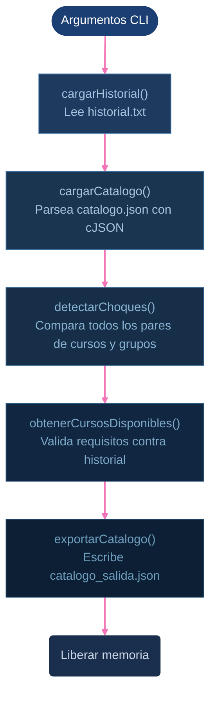

# CEmestre : Constructor de Horarios · Etapa 1 

**Curso:** CE1106 Paradigmas de Programación    
**Institución:** Instituto Tecnológico de Costa Rica  
**Integrantes:** Dylan Bonilla Barquero, Alanna Mendoza Fonseca, Miguel Valdelomar Martínez

## Descripción general

CEmestre es un sistema que ayuda a un estudiante del TEC a armar su horario de matrícula. Esta primera etapa, implementada en C bajo el paradigma imperativo, recibe el catálogo de cursos de dos carreras (Ingeniería en Computadores e Ingeniería en Electrónica) y detecta choques de horario entre todos los grupos disponibles, válida qué cursos puede matricular el estudiante según su historial académico y exporta el resultado en un archivo JSON, el cual muestra la información recopilada para cada curso del plan de estudios (primeros 4 semestres) del estudiante.

---

## Uso del ejecutable

El programa recibe exactamente dos argumentos por línea de comandos, en este orden: primero la ruta al catálogo de cursos de la carrera en formato JSON, y luego la ruta al archivo de historial del estudiante en formato TXT. Si alguno de los dos argumentos falta o la ruta es incorrecta, el programa reporta el error y termina sin generar salida. Una vez que ambos archivos se cargan correctamente, el procesamiento completo ocurre de forma automática y el archivo de salida se escribe en `etapa1_c/output/catalogo_salida.json` sin necesidad de parámetros adicionales.

```bash
./build/catalogo_run <ruta_catalogo.json> <ruta_historial.txt>
```

**Ejemplo:**
```bash
./build/catalogo_run etapa1_c/ArchivosEntrada/info_cursos/ingComputadores/catalogo_cursos_computadores.json etapa1_c/ArchivosEntrada/historial_computadores.txt
```

El archivo de salida se genera en `etapa1_c/output/catalogo_salida.json`.

---

## Arquitectura del proyecto

### Estructura de carpetas

```
CEmestre_Proyecto/
├── etapa1_c/                        # Módulo principal en C
│   ├── src/                         # Archivos de implementación (.c)
│   │   ├── main.c
│   │   ├── catalogo.c
│   │   ├── horario.c
│   │   ├── historial.c
│   │   ├── consulta.c
│   │   ├── exportar.c
│   │   └── manejoArreglos.c
│   ├── include/                     # Headers (.h)
│   │   ├── modelos.h                # Definición de structs principales
│   │   ├── constantes.h             # Constantes de tamaño
│   │   ├── catalogo.h
│   │   ├── horario.h
│   │   ├── historial.h
│   │   ├── consulta.h
│   │   ├── exportar.h
│   │   ├── manejoArreglos.h
│   │   └── listaEnlazada.h
│   ├── structures/
│   │   └── listaEnlazada.c          # Implementación de la lista enlazada
│   ├── lib/
│   │   ├── cJSON.c                  # Librería externa para manejo de JSON
│   │   └── cJSON.h
│   ├── ArchivosEntrada/             # Archivos de entrada (historial estudiante y planes de estudio)
│   │   ├── historial_computadores.txt
│   │   ├── historial_electronica.txt
│   │   └── info_cursos/
│   │       ├── ingComputadores/catalogo_cursos_computadores.json
│   │       └── ingElectronica/catalogo_cursos_electronica.json
│   └── output/
│       └── catalogo_salida.json     # Archivo generado por el programa
│  
└── Obtencion_Datos/                 # Scripts Python de recolección de datos
    ├── Computadores/
    │   ├── Obtener_Grupos_Escuelas.py   # Scraper del TEC-Digital
    │   ├── CombinarDatos.py             # Compara los datos crudos de los cursos con el plan de estudios para obtener lo necesario
    │   ├── horarios_raw.json            # Datos crudos de los cursos del TEC-Digital
    │   └── plan_estudios.json           # Plan de estudios extraído para cada carrera
    │   └── catalogo_cursos_computadores.json  # Cursos y sus horarios disponibles para el plan de estudios
    └── Electrónica/
        └── (misma estructura)
```

---

### Descripción de módulos

#### `main.c` — Punto de entrada y coordinador principal

Recibe dos argumentos por línea de comandos: la ruta del catálogo JSON y la ruta del historial del estudiante. Valida que ambos argumentos existan antes de proceder. Luego llama a cada módulo de manera que se sigue el siguiente orden: carga del historial → carga del catálogo → detección de choques → consulta de disponibilidad → exportación a archivo JSON de salida. Al finalizar, libera toda la memoria dinámica reservada durante la ejecución.

**Flujo de ejecución:**

 


---

#### `catalogo.c / catalogo.h` — Carga del catálogo

Lee el archivo JSON de entrada (archivo con todos los cursos y grupos que tienen los primeros cuatro semestres del plan de estudios del estudiante) completo en un buffer de memoria, lo parsea usando la librería `cJSON`, y construye un arreglo dinámico de structs `Curso` en memoria. Cada curso se extrae con la función interna `parsearCurso()`, que a su vez llama a `parsearGrupo()` para cada uno de los grupos del curso.

Funciones expuestas:
- `cargarCatalogo(rutaArchivoJson, &cantidadCursos)` → Retorna el arreglo de cursos.
- `liberarCatalogo(arregloCursos, cantidadCursos)` → Libera toda la memoria del catálogo incluyendo grupos, profesores, bloques y arreglos dinámicos de requisitos.

---


#### `horario.c / horario.h` — Detección de choques

Convierte los strings de horario al formato `"Martes - 7:30:10:20"` en structs `BloqueHorario` con los campos `inicioMin` y `finMin` expresados en minutos desde la medianoche. Debido a esta conversión, La detección de choque entre dos bloques se reduce a una comparación numérica simple. Luego recorre todos los pares posibles de cursos y grupos del catálogo y cuando detecta un conflicto agrega el código del curso afectado al arreglo dinámico `chocaCon` de cada uno de los dos cursos involucrados.

Funciones expuestas:
- `parsearBloqueHorario(texto, &bloque)` → Convierte el string al struct.
- `bloquesChocan(bloqueA, bloqueB)` → Retorna 1 si los rangos se solapan.
- `gruposChocan(grupoA, grupoB)` → Compara todos los bloques de dos grupos.
- `agregarChoque(curso, codigoQueChoca)` → Inserta un código en `chocaCon` sin duplicados, usando `realloc`.
- `detectarChoques(arregloCursos, cantidadCursos)` → Recorre todos los pares y actualiza ambos cursos si hay conflicto.

---

#### `historial.c / historial.h` — Carga historial del estudiante

Lee un archivo de texto plano con la siguiente estructura: primera línea es el nombre de la carrera, y las líneas siguientes son los códigos de los cursos aprobados. Realiza dos pasadas sobre el archivo: la primera cuenta las líneas válidas para saber cuánta memoria reservar, y la segunda las lee y almacena en un struct `Historial`.

Funciones expuestas:
- `cargarHistorial(rutaArchivo)` → Retorna un `Historial*` con la carrera y el arreglo de cursos aprobados.
- `liberarHistorial(historial)` → Libera todos los strings y el struct `Historial` generado .

---

#### `consulta.c / consulta.h` — Validación de requisitos

Recorre el catálogo completo y determina, para cada curso, si el estudiante cumple todos sus requisitos según el historial cargado. Descarta automáticamente los cursos que el estudiante ya aprobó. Si un curso cumple todos los requisitos, se marca con `estudiantePuedeMatricular = true` y se inserta en una lista enlazada de resultados. 

Funciones expuestas:
- `obtenerCursosDisponibles(arregloCursos, cantidadCursos, aprobados, cantidadAprobados)` → Retorna una `ListaCursos` con punteros a los cursos disponibles.

---

#### `exportar.c / exportar.h` — Generación del archivo de salida

Serializa el arreglo de structs `Curso` (ya procesado con choques y matriculabilidad calculados) de vuelta a JSON usando la biblioteca `cJSON`. Construye el JSON objeto por objeto: primero el curso con sus campos estáticos, luego sus arreglos dinámicos (`requisitos`, `correquisitos`, `choca_con`), y finalmente el arreglo de grupos con sus bloques, profesores, horarios y demás información. El resultado se escribe al archivo de salida `catalogo_salida.json`.

Funciones expuestas:
- `exportarCatalogo(arregloCursos, cantidadCursos, rutaSalida)` → Retorna 1 si tuvo éxito, 0 si hubo error.

---

#### `manejoArreglos.c / manejoArreglos.h` — Utilidades de strings

Contiene funciones de uso general compartidas por múltiples módulos para manejar arreglos dinámicos de strings y su conversión hacia o desde JSON.

Funciones expuestas:
- `copiarStr(destino, tamDestino, origen)` → Copia segura de string con límite de tamaño para evitar desbordamientos de buffer.
- `leerArregloStrings(arregloJson, &cantidad)` → Convierte un arreglo JSON de strings en un `char**` dinámico.
- `arregloStringsAJson(arreglo, cantidad)` → Convierte un `char**` en un arreglo `cJSON`.
- `liberarArregloStrings(arreglo, cantidad)` → Libera cada elemento y el arreglo contenedor.

---

#### `listaEnlazada.c / listaEnlazada.h` — Lista enlazada de cursos

Implementa una lista enlazada simple de punteros `Curso*`. Los nodos almacenan punteros al arreglo principal (no copias), por lo que la lista es liviana en memoria y no duplica datos. Se utiliza para acumular los cursos disponibles para el estudiante.

Funciones expuestas:
- `inicializarLista(lista)` → Deja la lista en estado vacío.
- `insertarCurso(lista, curso)` → Inserta un curso al final de la lista.
- `liberarLista(lista)` → Libera los nodos pero no los cursos apuntados (esos los libera `liberarCatalogo`).

---

#### `modelos.h` — Definición de structs

Define los cuatro structs de datos principales del sistema. Es incluido por la mayoría de los módulos.

#### `constantes.h` — Constantes del sistema

Define los tamaños máximos de los campos de texto de los structs usando `#define`. Centralizar estas constantes permite modificar límites sin tocar la lógica de los módulos.

#### `lib/cJSON` — Librería externa

Librería de código abierto para parsear y generar JSON en C puro. Se incluyó directamente en el proyecto (sin dependencias externas) para garantizar que el ejecutable compile sin configuración adicional.

---

## 2.2 Decisiones de diseño

### 2.2.1 Justificación de decisiones propias y específicas del dataset

#### Recolección de datos desde TEC-Digital

Para la obtención de los horarios de cursos se utilizó la Guía de Horarios del Instituto Tecnológico de Costa Rica. En una primera instancia se intentó trabajar con la versión pública de dicha guía, sin embargo, al estar construida con una tecnología antigua (ASP.NET WebForms), no exponía una API convencional de fácil acceso.
Como alternativa, se inspeccionó el módulo de Guía de Horario dentro del Expediente Estudiantil del TEC-Digital mediante las herramientas de desarrollo del navegador (DevTools → Network). A través de este análisis se identificó que la página realiza una solicitud HTTP de tipo POST al siguiente endpoint:

https://tecdigital.tec.ac.cr/tda-expediente-estudiantil/ajax/tabla_guia_horario

Dicha solicitud requiere tres parámetros en el cuerpo de la petición:


Adicionalmente, la solicitud requiere autenticación mediante la cookie de sesión ad_session_id, obtenida al iniciar sesión en el TEC-Digital.

Para la obtención del plan de estudios con requisitos y correquisitos de cada curso, se identificó un segundo endpoint utilizado por el módulo de malla curricular:

https://tecdigital.tec.ac.cr/tds-curriculum-exp/ajax/json_draw_angular?id_plan=2103

Este endpoint retorna un JSON con la estructura completa del plan de estudios, incluyendo los campos requirements, co_requirements y equivalent por curso, los cuales fueron utilizados para enriquecer el catálogo final.

Con base en ambos endpoints se desarrolló un script en Python que automatiza la descarga, limpieza y combinación de los datos, generando el archivo catalogo_cursos.json que sirve como entrada al programa en C.

De la información que podemos obtener por medio del API que usa tec digital quitamos la siguiente info de cada curso

- Aula
- Cupo
- Semestre en el que está la materia

Para cada escuela se obtuvo el payload donde se obtiene el código de la carrera que usa el api y se pone el archivo de python para que haga todos los cálculos, a partir de ese payload es que se genero el python para realizar consultas automáticas de acuerdo con el código de la escuela a la que pertenece cada curso. De manera que en el mismo python se pueden realizar múltiples consultas a todas las escuelas de interés y así obtener todos los grupos disponibles para cada curso


Mediante la obtención de los payloads nos dimos cuenta que el código del curso era el mismo o parecido que utilizaban para hacer consultas en el api de la página del tec digital


encontramos en plan de estudios de cada carrera en json al revisar las respuestas de la pagina al seleccionar la escuela de cada carrera especifica.

Esta decisión de automatizar la recolección (en lugar de transcribir manualmente) garantiza exactitud en los datos y permite regenerar el catálogo fácilmente ante cambios de horario.
