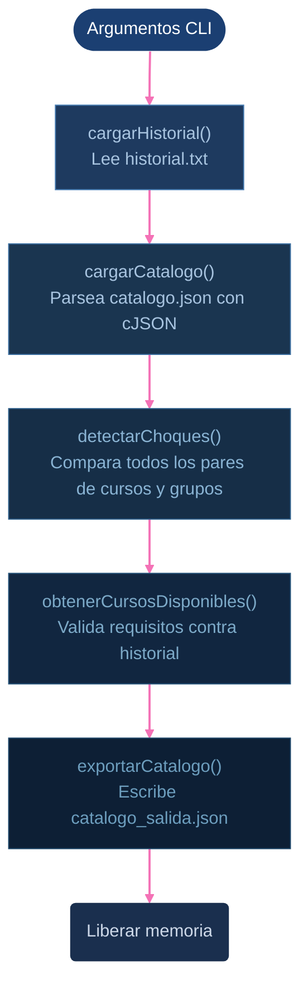
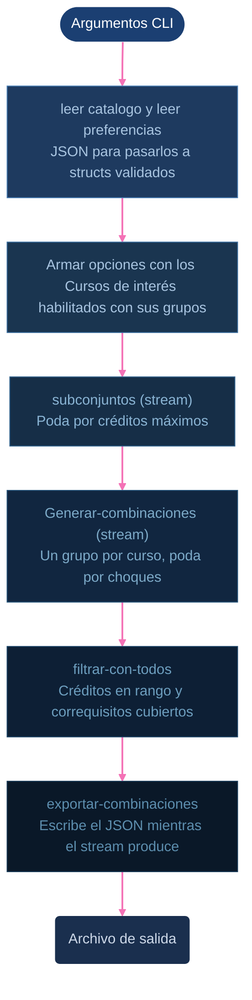
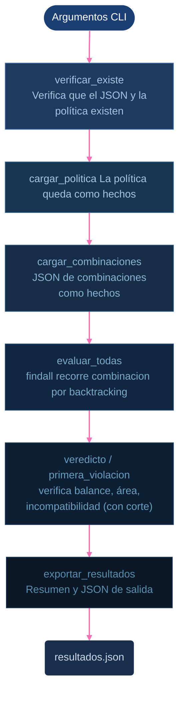

# CEmestre : Constructor de Horarios · Etapa 1 

**Curso:** CE1106 Paradigmas de Programación    
**Institución:** Instituto Tecnológico de Costa Rica  
**Integrantes:** Dylan Bonilla Barquero, Alanna Mendoza Fonseca, Miguel Valdelomar Martínez

## Descripción general

CEmestre es un sistema que ayuda a un estudiante del TEC a armar su horario de matrícula. Esta primera etapa, implementada en C bajo el paradigma imperativo, recibe el catálogo de cursos de dos carreras (Ingeniería en Computadores e Ingeniería en Electrónica) y detecta choques de horario entre todos los grupos disponibles, válida qué cursos puede matricular el estudiante según su historial académico y exporta el resultado en un archivo JSON, el cual muestra la información recopilada para cada curso del plan de estudios (primeros 4 semestres) del estudiante.

---

## Uso del ejecutable

El programa recibe exactamente dos argumentos por línea de comandos, en este orden: primero la ruta al catálogo de cursos de la carrera en formato JSON, y luego la ruta al archivo de historial del estudiante en formato TXT. Si alguno de los dos argumentos falta o la ruta es incorrecta, el programa reporta el error y termina sin generar salida. Una vez que ambos archivos se cargan correctamente, el procesamiento completo ocurre de forma automática y el archivo de salida se escribe en `etapa1_c/output/catalogo_salida.json` sin necesidad de parámetros adicionales.

```bash
./build/catalogo_run <ruta_catalogo.json> <ruta_historial.txt>
```

**Ejemplo:**
```bash
./build/catalogo_run etapa1_c/ArchivosEntrada/info_cursos/ingComputadores/catalogo_cursos_computadores.json etapa1_c/ArchivosEntrada/historial_computadores.txt
```

El archivo de salida se genera en `etapa1_c/output/catalogo_salida.json`.

---

## Arquitectura del proyecto

### Estructura de carpetas

```
CEmestre_Proyecto/
├── etapa1_c/                        # Módulo principal en C
│   ├── src/                         # Archivos de implementación (.c)
│   │   ├── main.c
│   │   ├── catalogo.c
│   │   ├── horario.c
│   │   ├── historial.c
│   │   ├── consulta.c
│   │   ├── exportar.c
│   │   └── manejoArreglos.c
│   ├── include/                     # Headers (.h)
│   │   ├── modelos.h                # Definición de structs principales
│   │   ├── constantes.h             # Constantes de tamaño
│   │   ├── catalogo.h
│   │   ├── horario.h
│   │   ├── historial.h
│   │   ├── consulta.h
│   │   ├── exportar.h
│   │   ├── manejoArreglos.h
│   │   └── listaEnlazada.h
│   ├── structures/
│   │   └── listaEnlazada.c          # Implementación de la lista enlazada
│   ├── lib/
│   │   ├── cJSON.c                  # Librería externa para manejo de JSON
│   │   └── cJSON.h
│   ├── ArchivosEntrada/             # Archivos de entrada (historial estudiante y planes de estudio)
│   │   ├── historial_computadores.txt
│   │   ├── historial_electronica.txt
│   │   └── info_cursos/
│   │       ├── ingComputadores/catalogo_cursos_computadores.json
│   │       └── ingElectronica/catalogo_cursos_electronica.json
│   └── output/
│       └── catalogo_salida.json     # Archivo generado por el programa
│  
└── Obtencion_Datos/                 # Scripts Python de recolección de datos
    ├── Computadores/
    │   ├── Obtener_Grupos_Escuelas.py   # Scraper del TEC-Digital
    │   ├── CombinarDatos.py             # Compara los datos crudos de los cursos con el plan de estudios para obtener lo necesario
    │   ├── horarios_raw.json            # Datos crudos de los cursos del TEC-Digital
    │   └── plan_estudios.json           # Plan de estudios extraído para cada carrera
    │   └── catalogo_cursos_computadores.json  # Cursos y sus horarios disponibles para el plan de estudios
    └── Electrónica/
        └── (misma estructura)
```

---

### Descripción de módulos

#### `main.c` — Punto de entrada y coordinador principal

Recibe dos argumentos por línea de comandos: la ruta del catálogo JSON y la ruta del historial del estudiante. Valida que ambos argumentos existan antes de proceder. Luego llama a cada módulo de manera que se sigue el siguiente orden: carga del historial → carga del catálogo → detección de choques → consulta de disponibilidad → exportación a archivo JSON de salida. Al finalizar, libera toda la memoria dinámica reservada durante la ejecución.

**Flujo de ejecución:**

 

```mermaid
flowchart TD
    A([ Argumentos CLI]) --> B
 
    B[" cargarHistorial()\nLee historial.txt"]
    B --> C
 
    C[" cargarCatalogo()\nParsea catalogo.json con cJSON"]
    C --> D
 
    D[" detectarChoques()\nCompara todos los pares de cursos y grupos"]
    D --> E
 
    E[" obtenerCursosDisponibles()\nValida requisitos contra historial"]
    E --> F
 
    F[" exportarCatalogo()\nEscribe catalogo_salida.json"]
    F --> G
 
    G(Liberar memoria)
 
    style A fill:#1B3F72,color:#fff,stroke:none
    style G fill:#1A2F4E,color:#cdd8e8,stroke:none
    style B fill:#1E3A5F,stroke:#4A7FB5,color:#A8C4E0
    style C fill:#1A3550,stroke:#3A6D9E,color:#A8C4E0
    style D fill:#162E47,stroke:#2E5F8A,color:#8AB4D4
    style E fill:#112640,stroke:#245278,color:#7DAAC8
    style F fill:#0D1F35,stroke:#1C4568,color:#6D9EBE
    linkStyle default stroke:#F472B6,stroke-width:2px
```

---

#### `catalogo.c / catalogo.h` — Carga del catálogo

Lee el archivo JSON de entrada (archivo con todos los cursos y grupos que tienen los primeros cuatro semestres del plan de estudios del estudiante) completo en un buffer de memoria, lo parsea usando la librería `cJSON`, y construye un arreglo dinámico de structs `Curso` en memoria. Cada curso se extrae con la función interna `parsearCurso()`, que a su vez llama a `parsearGrupo()` para cada uno de los grupos del curso.

Funciones expuestas:
- `cargarCatalogo(rutaArchivoJson, &cantidadCursos)` → Retorna el arreglo de cursos.
- `liberarCatalogo(arregloCursos, cantidadCursos)` → Libera toda la memoria del catálogo incluyendo grupos, profesores, bloques y arreglos dinámicos de requisitos.

---


#### `horario.c / horario.h` — Detección de choques

Convierte los strings de horario al formato `"Martes - 7:30:10:20"` en structs `BloqueHorario` con los campos `inicioMin` y `finMin` expresados en minutos desde la medianoche. Debido a esta conversión, La detección de choque entre dos bloques se reduce a una comparación numérica simple. Luego recorre todos los pares posibles de cursos y grupos del catálogo y cuando detecta un conflicto agrega el código del curso afectado al arreglo dinámico `chocaCon` de cada uno de los dos cursos involucrados.

Funciones expuestas:
- `parsearBloqueHorario(texto, &bloque)` → Convierte el string al struct.
- `bloquesChocan(bloqueA, bloqueB)` → Retorna 1 si los rangos se solapan.
- `gruposChocan(grupoA, grupoB)` → Compara todos los bloques de dos grupos.
- `agregarChoque(curso, codigoQueChoca)` → Inserta un código en `chocaCon` sin duplicados, usando `realloc`.
- `detectarChoques(arregloCursos, cantidadCursos)` → Recorre todos los pares y actualiza ambos cursos si hay conflicto.

---

#### `historial.c / historial.h` — Carga historial del estudiante

Lee un archivo de texto plano con la siguiente estructura: primera línea es el nombre de la carrera, y las líneas siguientes son los códigos de los cursos aprobados. Realiza dos pasadas sobre el archivo: la primera cuenta las líneas válidas para saber cuánta memoria reservar, y la segunda las lee y almacena en un struct `Historial`.

Funciones expuestas:
- `cargarHistorial(rutaArchivo)` → Retorna un `Historial*` con la carrera y el arreglo de cursos aprobados.
- `liberarHistorial(historial)` → Libera todos los strings y el struct `Historial` generado .

---

#### `consulta.c / consulta.h` — Validación de requisitos

Recorre el catálogo completo y determina, para cada curso, si el estudiante cumple todos sus requisitos según el historial cargado. Descarta automáticamente los cursos que el estudiante ya aprobó. Si un curso cumple todos los requisitos, se marca con `estudiantePuedeMatricular = true` y se inserta en una lista enlazada de resultados. 

Funciones expuestas:
- `obtenerCursosDisponibles(arregloCursos, cantidadCursos, aprobados, cantidadAprobados)` → Retorna una `ListaCursos` con punteros a los cursos disponibles.

---

#### `exportar.c / exportar.h` — Generación del archivo de salida

Serializa el arreglo de structs `Curso` (ya procesado con choques y matriculabilidad calculados) de vuelta a JSON usando la biblioteca `cJSON`. Construye el JSON objeto por objeto: primero el curso con sus campos estáticos, luego sus arreglos dinámicos (`requisitos`, `correquisitos`, `choca_con`), y finalmente el arreglo de grupos con sus bloques, profesores, horarios y demás información. El resultado se escribe al archivo de salida `catalogo_salida.json`.

Funciones expuestas:
- `exportarCatalogo(arregloCursos, cantidadCursos, rutaSalida)` → Retorna 1 si tuvo éxito, 0 si hubo error.

---

#### `manejoArreglos.c / manejoArreglos.h` — Utilidades de strings

Contiene funciones de uso general compartidas por múltiples módulos para manejar arreglos dinámicos de strings y su conversión hacia o desde JSON.

Funciones expuestas:
- `copiarStr(destino, tamDestino, origen)` → Copia segura de string con límite de tamaño para evitar desbordamientos de buffer.
- `leerArregloStrings(arregloJson, &cantidad)` → Convierte un arreglo JSON de strings en un `char**` dinámico.
- `arregloStringsAJson(arreglo, cantidad)` → Convierte un `char**` en un arreglo `cJSON`.
- `liberarArregloStrings(arreglo, cantidad)` → Libera cada elemento y el arreglo contenedor.

---

#### `listaEnlazada.c / listaEnlazada.h` — Lista enlazada de cursos

Implementa una lista enlazada simple de punteros `Curso*`. Los nodos almacenan punteros al arreglo principal (no copias), por lo que la lista es liviana en memoria y no duplica datos. Se utiliza para acumular los cursos disponibles para el estudiante.

Funciones expuestas:
- `inicializarLista(lista)` → Deja la lista en estado vacío.
- `insertarCurso(lista, curso)` → Inserta un curso al final de la lista.
- `liberarLista(lista)` → Libera los nodos pero no los cursos apuntados (esos los libera `liberarCatalogo`).

---

#### `modelos.h` — Definición de structs

Define los cuatro structs de datos principales del sistema. Es incluido por la mayoría de los módulos.

#### `constantes.h` — Constantes del sistema

Define los tamaños máximos de los campos de texto de los structs usando `#define`. Centralizar estas constantes permite modificar límites sin tocar la lógica de los módulos.

#### `lib/cJSON` — Librería externa

Librería de código abierto para parsear y generar JSON en C puro. Se incluyó directamente en el proyecto (sin dependencias externas) para garantizar que el ejecutable compile sin configuración adicional.

---

## 2.2 Decisiones de diseño

### 2.2.1 Justificación de decisiones propias y específicas del dataset

#### Recolección de datos desde TEC-Digital

Para la obtención de los horarios de cursos se utilizó la Guía de Horarios del Instituto Tecnológico de Costa Rica. En una primera instancia se intentó trabajar con la versión pública de dicha guía, sin embargo, al estar construida con una tecnología antigua (ASP.NET WebForms), no exponía una API convencional de fácil acceso.
Como alternativa, se inspeccionó el módulo de Guía de Horario dentro del Expediente Estudiantil del TEC-Digital mediante las herramientas de desarrollo del navegador (DevTools → Network). A través de este análisis se identificó que la página realiza una solicitud HTTP de tipo POST al siguiente endpoint:

https://tecdigital.tec.ac.cr/tda-expediente-estudiantil/ajax/tabla_guia_horario

Dicha solicitud requiere tres parámetros en el cuerpo de la petición:


Adicionalmente, la solicitud requiere autenticación mediante la cookie de sesión ad_session_id, obtenida al iniciar sesión en el TEC-Digital.

Para la obtención del plan de estudios con requisitos y correquisitos de cada curso, se identificó un segundo endpoint utilizado por el módulo de malla curricular:

https://tecdigital.tec.ac.cr/tds-curriculum-exp/ajax/json_draw_angular?id_plan=2103

Este endpoint retorna un JSON con la estructura completa del plan de estudios, incluyendo los campos requirements, co_requirements y equivalent por curso, los cuales fueron utilizados para enriquecer el catálogo final.

Con base en ambos endpoints se desarrolló un script en Python que automatiza la descarga, limpieza y combinación de los datos, generando el archivo catalogo_cursos.json que sirve como entrada al programa en C.

De la información que podemos obtener por medio del API que usa tec digital quitamos la siguiente info de cada curso

- Aula
- Cupo
- Semestre en el que está la materia

Para cada escuela se obtuvo el payload donde se obtiene el código de la carrera que usa el api y se pone el archivo de python para que haga todos los cálculos, a partir de ese payload es que se genero el python para realizar consultas automáticas de acuerdo con el código de la escuela a la que pertenece cada curso. De manera que en el mismo python se pueden realizar múltiples consultas a todas las escuelas de interés y así obtener todos los grupos disponibles para cada curso


Mediante la obtención de los payloads nos dimos cuenta que el código del curso era el mismo o parecido que utilizaban para hacer consultas en el api de la página del tec digital


Encontramos en plan de estudios de cada carrera en json al revisar las respuestas de la pagina al seleccionar la escuela de cada carrera especifica.

Esta decisión de automatizar la recolección (en lugar de transcribir manualmente) garantiza exactitud en los datos y permite regenerar el catálogo fácilmente ante cambios de horario.

#### Cursos compartidos entre carreras

Un caso concreto del dataset es que varios cursos aparecen en ambas carreras. Por ejemplo, `MA0101 Matemática General`, `QU1102 Laboratorio de Química Básica I` y `CS1502 Introducción a la Técnica, Ciencia y Tecnología` forman parte de los primeros semestres tanto de Ingeniería en Computadores como de Ingeniería en Electrónica. El catálogo de cada carrera es independiente, pero los datos de horario se obtienen de las mismas escuelas.

#### Cursos sin grupos en el período actual

El catálogo incluye `CI0205 Prueba Avanzada de Inglés`, que no tiene grupos registrados en el período consultado (II Semestre 2026). En lugar de descartarlo, se decidió incluirlo en el catálogo con `"grupos": []`, porque el curso existe en el plan de estudios y su ausencia de grupos es una condición del período, no un error del dato. Esto significa que puede aparecer como elegible para un estudiante que cumpla sus requisitos, aunque sin grupos disponibles para matricular actualmente.

#### Representación de horarios como enteros

Los bloques de horario del TEC-Digital vienen en texto con el formato `"Martes - 7:30:10:20"`. Se decidió convertirlos a minutos desde medianoche (por ejemplo, `7:30` → `450 minutos`) al momento de comparar, en lugar de guardar strings o structs en los archivos. Esto simplifica radicalmente la detección de choque: dos bloques chocan si y solo si `A.inicioMin < B.finMin && B.inicioMin < A.finMin`, sin necesidad de parsear strings durante la comparación.

Por ejemplo, `MA0101 grupo 001` tiene bloque `Martes - 7:30:10:20` (450 a 620 min) y `CE1101 grupo 001` tiene `Martes - 7:30:9:20` (450 a 560 min). Ambos coinciden en el mismo día y sus rangos se solapan, por lo que se detecta choque correctamente.

#### Correquisitos no validados como condición de acceso

Los correquisitos del plan de estudios (por ejemplo, `FI1102 Física General II` tiene como requisito `FI1101` y como correquisito `MA1102`) se almacenan en el catálogo de salida pero **no se usan para bloquear la matriculabilidad**. Esto es correcto porque los correquisitos son cursos que se deben llevar simultáneamente, no previamente. La validación de si el estudiante lleva el correquisito al mismo tiempo es responsabilidad de la Etapa 2, que ya trabaja con combinaciones de cursos.

---

### 2.2.2 Caso límite real encontrado y cómo se resolvió

**Problema:** Cursos compartidos entre múltiples escuelas generaban entradas duplicadas en `horarios_raw.json`.

Durante la recolección, el scraper consultaba múltiples escuelas por separado (Computadores, Ciencias, Matemática, Física, etc.) para obtener todos los grupos disponibles para los cursos de cada carrera. Esto hacía que cursos que aparecen en varias escuelas (como `MA0101` o `FI1101`) se incluyeran múltiples veces en el JSON crudo, con grupos duplicados o incluso inconsistentes entre sí.

**Solución:** En `CombinarDatos.py` se construyó un índice de horarios agrupado por código de curso (`horarios_por_codigo`), donde para cada código se acumulan todos los grupos encontrados en cualquier escuela. Al momento de generar el catálogo final, se toman todos los grupos de ese índice sin importar la escuela de origen, y se conservan todos (incluyendo los de escuelas distintas a la principal), ya que representan grupos realmente disponibles para ese curso en ese período. Esto garantiza que el catálogo refleje todas las opciones de horario reales.

---

### 2.2.3 Justificación del formato de salida

**Formato elegido: JSON**

El archivo de salida usa el mismo formato que el archivo de entrada: JSON. Esta decisión está directamente ligada a la naturaleza incremental del sistema: la Etapa 2 en Racket necesita consumir fácilmente los datos producidos en esta etapa, y JSON es un formato estándar con soporte nativo en prácticamente todos los lenguajes.

**Ventajas concretas para este proyecto:**

1. **Contrato claro entre etapas.** El JSON de salida extiende el de entrada añadiendo únicamente los dos campos calculados: `choca_con` (lista de códigos de cursos que generan conflicto) y `estudiante_puede_matricular` (booleano). Racket puede leer el mismo archivo sin transformaciones adicionales.

2. **Legibilidad durante desarrollo.** El archivo generado con `cJSON_Print()` produce JSON indentado y legible. Durante el desarrollo, esto permitió verificar manualmente que los choques y la matriculabilidad se calculaban correctamente sin necesidad de herramientas adicionales.

3. **Arreglos vacíos explícitos.** Se decidió exportar siempre `[]` en lugar de omitir las claves cuando un curso no tiene requisitos, correquisitos o choques. Esto hace el formato predecible: la Etapa 2 siempre puede asumir que las claves existen.

4. **Extensibilidad.** Si en etapas futuras se necesita agregar información adicional por curso (por ejemplo, una puntuación de prioridad o notas del estudiante), se puede añadir como un campo más al objeto JSON sin romper la compatibilidad con los campos existentes.

**Ejemplo del objeto de salida para un curso:**

```json
{
  "codigo": "FI1102",
  "nombre": "física general ii",
  "creditos": 3,
  "requisitos": ["FI1101"],
  "correquisitos": ["MA1102"],
  "choca_con": ["CE1103", "MA1403"],
  "estudiante_puede_matricular": false,
  "grupos": [
    {
      "numero_grupo": "001",
      "nombre": "Física general II",
      "tipo_grupo": "Regular",
      "profesores": ["Pérez Mora Carlos"],
      "bloques_horario": ["Martes - 7:30:9:20", "Jueves - 7:30:9:20"]
    }
  ]
}
```

---

## 2.3 Estructuras de datos desarrolladas

### `BloqueHorario`
```c
typedef struct {
    char dia[4];     // Abreviatura: "LUN", "MAR", "MIE", "JUE", "VIE"
    int inicioMin;   // Hora de inicio en minutos desde medianoche (ej: 7:30 → 450)
    int finMin;      // Hora de fin en minutos desde medianoche   (ej: 10:20 → 620)
} BloqueHorario;
```
Representa un bloque de tiempo ya parseado. Usar enteros en lugar de strings permite comparar rangos de horario con aritmética simple sin llamadas a funciones de string.

---

### `Grupo`
```c
typedef struct {
    char nombre[128];
    char numeroGrupo[16];
    char tipoGrupo[32];       // "Regular", "Asistida", etc.
    char **bloquesHorario;    // Arreglo dinámico de strings de horario
    int numBloquesHorario;
    char **profesores;        // Arreglo dinámico de nombres de profesores
    int numProfesores;
} Grupo;
```
Representa un grupo específico de un curso. Los bloques de horario se almacenan como strings originales para exportación y se parsean a `BloqueHorario` solo durante la comparación, evitando almacenar información redundante.

---

### `Curso`
```c
typedef struct {
    char codigo[16];
    char nombre[160];
    int creditos;
    char **requisitos;                // Arreglo dinámico de códigos
    int numRequisitos;
    char **correquisitos;             // Arreglo dinámico de códigos
    int numCorrequisitos;
    Grupo *grupos;                    // Arreglo dinámico de structs Grupo
    int numGrupos;
    char **chocaCon;                  // Calculado por detectarChoques()
    int numChocaCon;
    bool estudiantePuedeMatricular;   // Calculado por obtenerCursosDisponibles()
} Curso;
```
Estructura central del sistema. Todos los arreglos son dinámicos (reservados con `malloc`/`realloc`) porque la cantidad de grupos, requisitos y choques varía por curso y no se conoce en tiempo de compilación. Los campos `chocaCon` y `estudiantePuedeMatricular` se inicializan vacíos/falsos y se llenan durante el procesamiento.

---

### `Historial`
```c
typedef struct {
    char carrera[32];
    char **aprobados;   // Arreglo dinámico de códigos de cursos aprobados
    int cantidadAprobados;
} Historial;
```
Representa el estado académico del estudiante. El arreglo `aprobados` es dinámico porque su tamaño depende del contenido del archivo de historial. Se reserva en dos pasadas: primero se cuenta el número de líneas y luego se reserva la memoria exacta necesaria.

---

### `NodoCurso` y `ListaCursos`
```c
typedef struct NodoCurso {
    Curso *curso;               // Puntero al curso en el arreglo principal
    struct NodoCurso *siguiente;
} NodoCurso;

typedef struct ListaCursos {
    NodoCurso *cabeza;
    int cant;
} ListaCursos;
```
Lista enlazada simple usada para acumular los cursos disponibles para el estudiante. Los nodos almacenan punteros (no copias) al arreglo principal de cursos, por lo que la lista no duplica datos en memoria. Al liberar la lista, solo se liberan los nodos, no los cursos apuntados.

---

## Compilación

```bash
gcc -o build/catalogo_run \
    src/main.c src/catalogo.c src/horario.c src/historial.c \
    src/consulta.c src/exportar.c src/manejoArreglos.c \
    structures/listaEnlazada.c lib/cJSON.c \
    -I include -I lib \
    -Wall -Wextra -std=c11
```

---

# CEmestre : Constructor de Horarios · Etapa 2

## Descripción general

CEmestre es un sistema que ayuda a un estudiante del TEC a armar su horario de matrícula. Esta segunda etapa, implementada en Racket bajo el paradigma funcional (Typed Racket), recibe el catálogo de cursos que produjo la Etapa 1 en C (con los choques de horario entre grupos y la elegibilidad de cada curso ya calculados) y un archivo de preferencias del estudiante con los cursos y grupos que le interesan y el rango de créditos deseado. A partir de eso genera, de forma perezosa mediante streams, las combinaciones de horario válidas (un grupo por cada curso elegido y sin choques entre ellos), las filtra por el rango de créditos y por los correquisitos, y las exporta a un archivo JSON que la Etapa 3 (Prolog) va a consumir.

---

## Uso del ejecutable

El programa se puede ejecutar de tres formas. En todas recibe tres rutas: el catálogo de la Etapa 1 (JSON), el archivo de preferencias del estudiante (JSON) y el archivo de salida (JSON).

### 1. Botón Run en DrRacket

Se abre `main.rkt` y se presiona Run. Como no hay argumentos de línea de comandos, se usan las rutas por defecto definidas al inicio de `main.rkt`:

| Constante | Valor por defecto |
|---|---|
| `catalogo-por-defecto` | `../ArchivosEntrada/catalogo_salida.json` |
| `preferencias-por-defecto` | `../ArchivosEntrada/preferencias_ejemplo.json` |
| `salida-por-defecto` | `../ArchivosSalida/combinaciones_salida.json` |


### 2. Línea de comandos

Desde la carpeta del proyecto:

```bash
racket main.rkt <catalogo.json> <preferencias.json> <salida.json>
```

**Ejemplo:**
```bash
racket main.rkt ../ArchivosEntrada/catalogo_salida.json ../ArchivosEntrada/preferencias_ejemplo.json ../ArchivosSalida/combinaciones_salida.json
```

### 3. Llamando `ejecutar` desde la ventana de Interactions de DrRacket

Después de presionar Run, se puede probar con otros archivos sin modificar el código:

```racket
(ejecutar "../ArchivosEntrada/catalogo_salida.json"
          "../ArchivosEntrada/preferencias_ejemplo.json"
          "../ArchivosSalida/combinaciones_salida.json")
```

### Mensajes del programa

Al terminar, `ejecutar` imprime cuántas combinaciones escribió y en qué archivo.

### Archivos de entrada

**1. Catálogo (salida de la Etapa 1).** Arreglo JSON de cursos. Esta etapa usa los siguientes campos, y si alguno falta o tiene un tipo distinto el programa se detiene con un mensaje que indica cuál:

```json
{
  "codigo": "CE1101",
  "nombre": "introducción a la programación",
  "creditos": 3,
  "carreras": ["Ingeniería en Computadores"],
  "requisitos": [],
  "correquisitos": [],
  "ya_aprobado": false,
  "estudiante_puede_matricular": true,
  "grupos": [
    {
      "id_grupo": 1,
      "numero_grupo": "001",
      "tipo_grupo": "Regular",
      "profesores": ["Schmidt Peralta Jeff"],
      "bloques_horario": ["Martes - 7:30:9:20", "Jueves - 7:30:9:20"],
      "choca_con": [{"curso": "MA1403", "id_grupo": 1}]
    }
  ]
}
```

**2. Preferencias del estudiante.** Objeto JSON con el rango de créditos y la lista de cursos de interés, cada uno con los grupos que el estudiante está dispuesto a matricular (más de un grupo por curso cuando aplica):

```json
{
  "creditos_minimos": 7,
  "creditos_maximos": 10,
  "cursos_interes": [
    {"curso": "MA1403", "grupos": [1, 2]},
    {"curso": "CE1101", "grupos": [1, 2]}
  ]
}
```

Los números de `grupos` corresponden al `id_grupo` del catálogo (el identificador único del grupo dentro de su curso), no al `numero_grupo` visible (`"001"`).

---

## 2.1 Arquitectura del proyecto

### Estructura de carpetas

```
etapa2_racket/
├── ArchivosEntrada/
│   ├── catalogo_salida.json         # Catálogo producido por la Etapa 1 (C)
│   └── preferencias_ejemplo.json    # Preferencias del estudiante
├── ArchivosSalida/
│   └── combinaciones_salida.json    # Archivo generado por el programa
└── src/
    ├── main.rkt                     # Punto de entrada y coordinador
    ├── modelos.rkt                  # Definición de structs
    ├── lectura.rkt                  # JSON -> structs, con validación
    ├── choques.rkt                  # Consulta de choques entre grupos
    ├── streams.rkt                  # Núcleo perezoso (sin tipos)
    ├── combinaciones.rkt            # Genera combinaciones con streams
    ├── filtros.rkt                  # Opciones y reglas de filtrado
    └── exportar.rkt                 # Combinaciones -> JSON de salida
```

---

### Flujo de ejecución


```mermaid
flowchart TD
    A([Argumentos CLI]) --> B

    B["leer catalogo y leer preferencias\nJSON para pasarlos a structs validados"]
    B --> C

    C["Armar opciones con los \nCursos de interés habilitados con sus grupos"]
    C --> D

    D["subconjuntos (stream)\nPoda por créditos máximos"]
    D --> E

    E["Generar-combinaciones (stream)\nUn grupo por curso, poda por choques"]
    E --> F

    F["filtrar-con-todos\nCréditos en rango y correquisitos cubiertos"]
    F --> G

    G["exportar-combinaciones\nEscribe el JSON mientras el stream produce"]
    G --> H(Archivo de salida)

    style A fill:#1B3F72,color:#fff,stroke:none
    style H fill:#1A2F4E,color:#cdd8e8,stroke:none
    style B fill:#1E3A5F,stroke:#4A7FB5,color:#A8C4E0
    style C fill:#1A3550,stroke:#3A6D9E,color:#A8C4E0
    style D fill:#162E47,stroke:#2E5F8A,color:#8AB4D4
    style E fill:#112640,stroke:#245278,color:#7DAAC8
    style F fill:#0D1F35,stroke:#1C4568,color:#6D9EBE
    style G fill:#0A1828,stroke:#183A58,color:#5D8EAE
    linkStyle default stroke:#F472B6,stroke-width:2px
```
---

### Descripción de módulos

#### `main.rkt` — Punto de entrada y coordinador principal

Une todas las piezas. Lee los argumentos, carga los archivos, valida que el mínimo de créditos no supere el máximo, construye el stream de combinaciones válidas y se lo pasa al exportador. Todo el cálculo está en `construir-combinaciones`, que no hace trabajo hasta que alguien consume el stream.

Funciones principales:
- `construir-combinaciones(catalogo, prefs)` → Retorna el stream de combinaciones válidas.
- `subconjuntos(opciones, disponible)` → Stream de los subconjuntos de cursos cuyos créditos no superan lo disponible.
- `creditos-de-opciones(opciones)` y `sumar-creditos(selecciones)` → Suman créditos recursivamente.
- `selecciones->combinacion(selecciones)` → Convierte una lista de pares curso-grupo en un struct `combinacion` con su total de créditos.
- `ejecutar(ruta-catalogo, ruta-preferencias, ruta-salida)` → Corre todo el proceso y retorna cuántas combinaciones se exportaron.

---

#### `modelos.rkt` — Definición de structs

Define los ocho structs del sistema (ver sección 2.3). Todos son inmutables y transparentes, el archivo los exporta con `all-defined-out` para que el resto de módulos los use.

---

#### `lectura.rkt` — Carga y validación de los archivos de entrada

Convierte el JSON del catálogo y el de preferencias en structs. Cada valor pasa por una función de validación que lanza un error con un mensaje claro si el campo no existe o no tiene el tipo esperado.

Funciones principales:
- `leer-catalogo(ruta)` → Retorna una lista de structs `curso`.
- `leer-preferencias(ruta)` → Retorna un struct `preferencias`.

---

#### `choques.rkt` — Consulta de choques entre grupos

Consulta el campo `choca_con` que la Etapa 1 ya calculó para cada grupo. Un par curso-grupo se identifica por `(código del curso, id_grupo)`.

Funciones principales:
- `selecciones-chocan?` → Indica si dos pares curso-grupo chocan.
- `choca-con-elegidos?` → Indica si una opcion candidata choca con alguna de las ya elegidas. Es la regla que usa el generador para podar.
---

#### `streams.rkt` — Núcleo perezoso

Contiene lo que necesita `stream-cons`.

Funciones principales :
- `append-perezoso(primero, resto-thunk)` → Concatena dos streams sin calcular el segundo hasta que el primero se acabe. El segundo viene envuelto en una función sin parámetros (thunk).
- `append-map-perezoso(f, lista)` → Aplica `f` (que devuelve un stream) a cada elemento de la lista y junta los resultados en un solo stream, de forma perezosa.
---

#### `combinaciones.rkt` — Generación de combinaciones

Genera, con streams, las combinaciones de un grupo por curso. Recibe una lista donde cada elemento son las alternativas de un curso y va eligiendo un grupo de cada uno, descartando una rama apenas la candidata choca con lo ya elegido.

Funciones principales:
- `selecciones-de-opcion(opcion)` → Convierte un curso de interés en la lista de pares curso-grupo que se pueden probar.
- `opciones->listas(opciones)` → Hace lo anterior para todas las opciones.
- `generar-combinaciones(cursos, elegidos)` → Retorna el stream de combinaciones. Internamente usa `probar-candidata` (decide si una candidata se agrega o se descarta) y `combinacion-final` (cierra una combinación completa).

---

#### `filtros.rkt` — Opciones y reglas de filtrado

Contiene la función con polimorfismo paramétrico del proyecto y las reglas con las que se filtran las combinaciones.

Funciones principales:
- `filtrar-con-todos(criterios, secuencia)` → Función polimórfica `(All (A) ...)`: deja pasar solo los elementos de un stream que cumplen todas las reglas de la lista.
- `creditos-en-rango?(minimo, maximo)` → Devuelve una regla que indica si una combinación tiene los créditos dentro del rango.
- `correquisitos-cubiertos?(catalogo)` → Devuelve una regla que indica si todos los correquisitos de una combinación están cubiertos.
- `armar-opciones(catalogo, intereses)` → Busca cada curso de interés en el catálogo y se queda con los habilitados que tienen al menos uno de los grupos pedidos.

---

#### `exportar.rkt` — Generación del archivo de salida

Serializa las combinaciones a JSON y las escribe a medida que el stream las produce, sin convertirlo antes a una lista. Al final escribe cuántas combinaciones fueron.

Funciones principales:
- `exportar-combinaciones(ruta, minimo, maximo, secuencia)` → Crea el archivo de salida y retorna el total de combinaciones escritas.
- `seleccion->json(par)` y `combinacion->json(comb, id)` → Convierten los structs a objetos JSON.

---

## 2.2 Decisiones de diseño

### 2.2.1 Justificación de decisiones propias y específicas de la implementación

#### Se reutiliza `choca_con` de la Etapa 1 en lugar de recalcular los horarios

El enunciado indica que la lógica de choques ya construida no debe modificarse, y la Etapa 1 deja calculado, para cada grupo, con cuáles grupos de otros cursos choca. Racket solo consulta esa información. Por ejemplo, `CE1101` grupo 001 se imparte martes y jueves de 7:30 a 9:20; cualquier grupo que coincida con ese horario aparece en su lista `choca_con`, y `choca-con-elegidos?` lo detecta sin interpretar ningún horario.

Como el número de grupo se repite entre cursos, cada choque se identifica con el par `(código del curso, id_grupo)`, donde `id_grupo` es el identificador único dentro del curso que asigna la Etapa 1. La Etapa 1 registra cada choque en ambos grupos, por lo que basta con revisar uno de los dos lados.

#### `streams.rkt` sin tipos, conectado con `require/typed`

`stream-cons` no se puede usar directamente dentro de `#lang typed/racket`: el verificador de tipos falla con un error de identificador sin tipo (`missing type for identifier`). Por eso las funciones que construyen streams con `stream-cons` viven en `streams.rkt`, escrito en `#lang racket`, y los módulos tipados las importan declarando su tipo con `require/typed`:

```racket
(require/typed "streams.rkt"
  [append-map-perezoso (All (A B) (-> (-> A (Sequenceof B)) (Listof A) (Sequenceof B)))])
```

Esa declaración también funciona como contrato en la frontera entre ambos archivos, de modo que los datos que cruzan se verifican en tiempo de ejecución.

#### Poda de choques durante la generación

`generar-combinaciones` no arma la combinación completa para descartarla después: en cuanto un grupo candidato choca con alguno de los ya elegidos (`choca-con-elegidos?`), devuelve un stream vacío y esa rama no se explora más. Por ejemplo, si el grupo 001 de `MA1403` choca con el grupo 001 de `CE1101`, ninguna combinación que contenga ambos se llega a generar.

#### Los cursos de interés son opciones: cada combinación usa un subconjunto

Cada combinación incluye un subconjunto de los cursos de interés, con un grupo por cada curso elegido, cuyo total de créditos cae en el rango pedido. Esta interpretación hace que el rango de créditos tenga sentido: si cada combinación incluyera siempre todos los cursos de interés, el total de créditos sería el mismo en todas y el filtro no discriminaría nada. Si todos los cursos juntos se pasan del máximo, igual se generan combinaciones con los subconjuntos que sí caben.

Los créditos dependen del curso y no del grupo, así que `subconjuntos` poda antes de generar grupos: apenas un curso ya no cabe en los créditos disponibles, deja de explorar los subconjuntos que lo incluyen. Después, `construir-combinaciones` se queda solo con los subconjuntos no vacíos que alcanzan el mínimo y genera las combinaciones de grupos de cada uno.

#### Filtros como reglas reutilizables

`filtrar-con-todos` es la función con polimorfismo paramétrico: recibe una lista de reglas `(-> A Boolean)` y un stream de elementos de cualquier tipo `A`, y devuelve el stream con los elementos que cumplen todas las reglas. Funciona igual con combinaciones, cursos o números, porque no usa nada específico del tipo. Las reglas se construyen con funciones que devuelven funciones: `creditos-en-rango?` recibe el mínimo y el máximo y devuelve la regla que revisa los créditos de una combinación, y `correquisitos-cubiertos?` recibe el catálogo y devuelve la regla de correquisitos. Agregar un criterio nuevo es agregar una regla a la lista, sin modificar `filtrar-con-todos`.

Un correquisito se considera cubierto si el curso ya está aprobado en el catálogo o si está dentro de la misma combinación.

---

### 2.2.2 Caso límite real encontrado y cómo se resolvió

**Problema:** Cuando ningún curso de interés era válido, el programa exportaba una combinación vacía con 0 créditos en lugar de ninguna.

Mientras probábamos el generador con una lista de cursos de interés vacía (por ejemplo, un código que no existe en el catálogo, o cursos que el estudiante no puede matricular), `armar-opciones` devolvía una lista vacía. Pero `generar-combinaciones` interpreta "no quedan cursos por elegir" como que ya hay una combinación completa, así que producía **una** combinación sin ningún curso y con 0 créditos. Si además el mínimo de créditos era 0, esa "combinación" pasaba el filtro y se habría exportado como si fuera un horario válido.

**Solución:** En `construir-combinaciones` se excluyen los subconjuntos vacíos antes de generar las combinaciones, con un filtro perezoso que exige que el subconjunto no sea vacío y alcance el mínimo de créditos:

```racket
(lambda ([sub : (Listof opcion)])
  (and (not (null? sub)) (>= (creditos-de-opciones sub) minimo)))
```

Con esto, una lista de intereses sin cursos válidos produce un archivo de salida con `"combinaciones": []` y `"total_combinaciones": 0`, y el programa avisa por consola qué cursos se omitieron.

---

### 2.2.3 Justificación del formato de salida

**Formato elegido: JSON**

Se mantuvo JSON porque es el formato de la entrada de esta etapa, y porque los datos son jerárquicos: una combinación contiene varios pares curso-grupo, y cada par lleva los datos de su curso, incluida una lista de carreras. Eso no se representa de forma limpia en CSV. Además, la Etapa 3 (Prolog) y la Etapa 4 (Java) tienen bibliotecas para leer JSON.

**Estructura del archivo:**

```json
{
  "creditos_minimos": 7,
  "creditos_maximos": 10,
  "combinaciones": [
    {
      "id": 1,
      "creditos_totales": 7,
      "selecciones": [
        {
          "curso": "MA1403",
          "nombre": "matemática discreta",
          "creditos": 4,
          "id_grupo": 1,
          "numero_grupo": "001",
          "carreras": ["Ingeniería en Computadores"]
        },
        {
          "curso": "CE1101",
          "nombre": "introducción a la programación",
          "creditos": 3,
          "id_grupo": 2,
          "numero_grupo": "002",
          "carreras": ["Ingeniería en Computadores"]
        }
      ]
    }
  ],
  "total_combinaciones": 1
}
```

**Decisiones de diseño ligadas al formato:**

1. **Escritura perezosa:** `escribir-combinaciones` escribe cada combinación apenas el stream la genera, sin armar antes una lista completa. Así la generación con streams no pierde su sentido.
2. **`total_combinaciones` al final:** solo se conoce después de consumir el stream, por lo que lo lleva el acumulador del `for/fold` y se escribe al cerrar.
3. **`id_grupo` y `numero_grupo`:** el primero es el que usa `choca_con`. El segundo es el número visible que mostrará en etapas posteriores.
4. **`carreras` como lista:** hay cursos compartidos entre carreras (ej. `MA0101`), y una lista cubre ambos casos.
5. **Datos listos para Prolog:** cada combinación lleva un `id` y sus `creditos_totales`, y el encabezado repite el rango de créditos, así que Prolog no recalcula nada.

---

## 2.3 Estructuras de datos desarrolladas

Todas están definidas en `modelos.rkt` con `struct`, tipadas campo por campo y con `#:transparent`.

### `choque`
```racket
(struct choque ([codigo-curso : String]
                [id-grupo : Integer])
  #:transparent)
```
Un choque de horario: identifica el grupo de otro curso con el que choca un grupo. Equivale a un elemento de `choca_con` en el JSON de la Etapa 1.

---

### `grupo`
```racket
(struct grupo ([id : Integer]
               [numero : String]
               [tipo : String]
               [profesores : (Listof String)]
               [bloques : (Listof String)]
               [choques : (Listof choque)])
  #:transparent)
```
Un grupo de un curso. `id` lo distingue de los demás grupos del mismo curso (el número visible se repite entre cursos, y hasta puede repetirse dentro de uno), `bloques` guarda los horarios como texto y `choques` trae los choques ya calculados por C.

---

### `curso`
```racket
(struct curso ([codigo : String]
               [nombre : String]
               [creditos : Integer]
               [requisitos : (Listof String)]
               [correquisitos : (Listof String)]
               [carreras : (Listof String)]
               [ya-aprobado : Boolean]
               [puede-matricular : Boolean]
               [grupos : (Listof grupo)])
  #:transparent)
```
Refleja el curso tal como lo exporta la Etapa 1. `carreras` es una lista porque un curso puede pertenecer a más de una carrera, `ya-aprobado` permite saber si un correquisito ya se cumplió, y `puede-matricular` indica si el estudiante cumple los requisitos.

---

### `interes`
```racket
(struct interes ([codigo-curso : String]
                 [ids-grupos : (Listof Integer)])
  #:transparent)
```
Un curso que el estudiante quiere matricular, junto con los grupos que está dispuesto a tomar.

---

### `preferencias`
```racket
(struct preferencias ([creditos-minimos : Integer]
                      [creditos-maximos : Integer]
                      [intereses : (Listof interes)])
  #:transparent)
```
El archivo de preferencias completo: el rango de créditos y la lista de intereses.

---

### `opcion`
```racket
(struct opcion ([curso : curso]
                [grupos : (Listof grupo)])
  #:transparent)
```
Un curso de interés ya validado (existe en el catálogo y se puede matricular), junto con solo los grupos pedidos que realmente existen en él. Es la entrada del generador.

---

### `seleccion`
```racket
(struct seleccion ([curso : curso]
                   [grupo : grupo])
  #:transparent)
```
Un par curso-grupo escogido dentro de una combinación. Es la unidad con la que trabaja el generador y la que se exporta.

---

### `combinacion`
```racket
(struct combinacion ([selecciones : (Listof seleccion)]
                     [creditos : Integer])
  #:transparent)
```
Una combinación de horario: varios pares curso-grupo sin choques y la suma de sus créditos. Es el elemento de los streams que se filtran y se exportan.

---

### Streams (secuencias perezosas)

Además de los structs, la estructura central del programa es el stream: una secuencia cuyos elementos se calculan solo cuando alguien los pide, por lo que en memoria nunca existe la lista completa de combinaciones. Se construye con `stream-cons` en `streams.rkt` y se usa en todo el flujo:

| Stream | Tipo de sus elementos | Quién lo produce |
|---|---|---|
| Subconjuntos de cursos | `(Listof opcion)` | `subconjuntos` (`main.rkt`) |
| Combinaciones de un subconjunto | `(Listof seleccion)` | `generar-combinaciones` (`combinaciones.rkt`) |
| Combinaciones con créditos | `combinacion` | `stream-map` en `construir-combinaciones` |
| Combinaciones filtradas | `combinacion` | `filtrar-con-todos` (`filtros.rkt`) |

Operaciones desarrolladas:
- `append-perezoso(primero, resto-thunk)`: concatena dos streams. El segundo llega envuelto en un thunk, así que solo se calcula cuando el primero se acaba.
- `append-map-perezoso(f, lista)`: aplica `f` a cada elemento y junta los streams resultantes en uno solo.

---

## Ejecución

Requiere Racket instalado (el proyecto se probó con DrRacket 9.3). Las formas de ejecutarlo, con sus rutas de entrada y salida, están en la sección [Uso del ejecutable](#uso-del-ejecutable). No hay un paso de compilación aparte.

---

# CEmestre : Constructor de Horarios · Etapa 3

## Descripción general

CEmestre es un sistema que ayuda a un estudiante del TEC a armar su horario de matrícula. Esta tercera etapa, implementada en Prolog bajo el paradigma lógico, recibe las combinaciones de horario que generó la Etapa 2 en Racket y un archivo de política académica escrito como hechos. Evalúa cada combinación contra tres reglas (balance entre carreras, límite de cursos por área e incompatibilidad entre cursos) y exporta, para cada una, si cumple y, en caso contrario, cuál es la **primera** regla que viola. El resultado se escribe en un archivo JSON que la Etapa 4 (Java) va a consumir.

---

## Uso del ejecutable

El programa se ejecuta con `swipl` desde la línea de comandos, estando sobre la carpeta `etapa3_prolog/src/`. Recibe las rutas de tres archivos: las combinaciones de la Etapa 2 (JSON), el archivo de política (`.pl`) y el archivo de salida (JSON).

```bash
swipl main.pl <combinaciones.json> <politica.pl> <resultados.json>
```

**Ejemplo:**
```bash
swipl main.pl ../ArchivosEntrada/combinaciones_salida.json ../ArchivosEntrada/politica.pl ../ArchivosSalida/resultados.json
```

Si se ejecuta sin argumentos se usan las rutas por defecto, definidas en `ruta_defecto/3` de `main.pl`:

| Archivo | Ruta por defecto |
|---|---|
| Combinaciones | `../ArchivosEntrada/combinaciones_salida.json` |
| Política | `../ArchivosEntrada/politica.pl` |
| Salida | `../ArchivosSalida/resultados.json` |

Si se pasa una cantidad de argumentos distinta de 0 o 3, el programa imprime el uso correcto y termina con código 1. Si el archivo de combinaciones o el de política no existen, imprime `No existe el archivo: <ruta>` y termina con código 1, sin escribir salida.

### Mensajes del programa

Al terminar, imprime la ruta del archivo escrito y un resumen:

```
Resultados escritos en ../ArchivosSalida/resultados.json
Total: 69, cumplen: 28, rechazadas: 41
```

### Archivos de entrada

**1. Combinaciones (salida de la Etapa 2).** Esta etapa lee de cada combinación su `id`, sus `creditos_totales` y la lista `selecciones`. De cada selección usa `curso`, `id_grupo`, `numero_grupo`, `creditos`, `carreras` y `area`. El campo `area` es el nuevo que se agregó en C y se propagó por Racket. Los demás (como `nombre`) se ignoran. El ejemplo muestra una combinación con solo su primer curso.

```json
{
  "id": 13,
  "creditos_totales": 11,
  "selecciones": [
    {
      "curso": "CE1103",
      "nombre": "algoritmos y estructuras de datos i",
      "creditos": 4,
      "id_grupo": 1,
      "numero_grupo": "001",
      "carreras": ["Computadores"],
      "area": "Programación y software"
    }
  ]
}
```

**2. Política (`politica.pl`).** Los parámetros de la política son hechos de Prolog, de modo que cambiarlos es editar el archivo, sin tocar el código:

```prolog
max_carrera('Computadores', 80).
max_carrera('Electronica', 80).
max_cursos_area(2).

incompatibles('QU1106', 'EL2207').
incompatibles('EL3212', 'EL4703').
incompatibles('SE1100', 'SE1200').
incompatibles('SE1100', 'SE1400').
incompatibles('SE1400', 'SE1200').
```


---

## 2.1 Arquitectura del proyecto

### Estructura de carpetas

```
etapa3_prolog/
├── ArchivosEntrada/
│   ├── combinaciones_salida.json    # Combinaciones de la Etapa 2 (Racket)
│   └── politica.pl                  # Política académica como hechos
├── ArchivosSalida/
│   └── resultados.json              # Archivo generado por el programa
└── src/
    ├── main.pl                      # Punto de entrada y coordinador
    ├── carga.pl                     # JSON -> hechos
    ├── reglas.pl                    # Las tres reglas de política
    ├── razon.pl                     # Primera regla violada y veredicto
    ├── consultas.pl                 # Predicado usable en varios modos
    └── exportar.pl                  # Evaluación de todas las combinaciones y JSON de salida
```

---

### Flujo de ejecución


```mermaid
flowchart TD
    A([Argumentos CLI]) --> B

    B["verificar_existe\n Verifica que el JSON y la política existen"]
    B --> C

    C["cargar_politica La política queda como hechos"]
    C --> D

    D["cargar_combinaciones\n JSON de combinaciones como hechos"]
    D --> E

    E["evaluar_todas\nfindall recorre combinacion por backtracking"]
    E --> F

    F["veredicto / primera_violacion\n verifica balance, área, incompatibilidad (con corte)"]
    F --> G

    G["exportar_resultados\nResumen y JSON de salida"]
    G --> H(resultados.json)

    style A fill:#1B3F72,color:#fff,stroke:none
    style H fill:#1A2F4E,color:#cdd8e8,stroke:none
    style B fill:#1E3A5F,stroke:#4A7FB5,color:#A8C4E0
    style C fill:#1A3550,stroke:#3A6D9E,color:#A8C4E0
    style D fill:#162E47,stroke:#2E5F8A,color:#8AB4D4
    style E fill:#112640,stroke:#245278,color:#7DAAC8
    style F fill:#0D1F35,stroke:#1C4568,color:#6D9EBE
    style G fill:#0A1828,stroke:#183A58,color:#5D8EAE
    linkStyle default stroke:#F472B6,stroke-width:2px
```
---

### Descripción de módulos

Cada módulo es un archivo de Prolog con su propio `:- module(...)` y solo exporta lo que otros módulos necesitan.

#### `main.pl` — Punto de entrada y coordinador principal

Lee los argumentos de la línea de comandos, verifica que existan los archivos de entrada, carga la política y las combinaciones, exporta los resultados y muestra el resumen.

Predicados principales:
- `main(Argv)` → Punto de entrada. Si los argumentos no son válidos muestra el uso y termina con código 1.
- `argumentos(Argv, Combinaciones, Politica, Salida)` → Acepta cero argumentos (rutas por defecto) o exactamente tres.
- `ejecutar(Combinaciones, Politica, Salida)` → Corre todo el proceso.
- `verificar_existe(Ruta)` → Termina el programa con un mensaje si el archivo no existe.
- `mostrar_resumen(Salida, Resumen)` → Imprime la ruta escrita y los totales.

---

#### `carga.pl` — Carga de datos

Lee el JSON de la Etapa 2 y lo convierte en hechos `combinacion(Id, CreditosTotales, Cursos)`.

Predicados principales:
- `cargar_politica(Ruta)` → Carga `politica.pl` como un archivo de hechos normal, con `consult`.
- `cargar_combinaciones(Ruta)` → Abre el JSON con `json_read_dict`, borra las combinaciones anteriores y registra las nuevas.
- `registrar_combinaciones(Lista)` → Recorre la lista por recursión y guarda un hecho por combinación.
- `convertir_cursos(CursosJson, Cursos)` y `crear_curso_grupo(Dict, CursoGrupo)` → Convierten cada selección del JSON en un término `curso_grupo/6`.

El JSON se lee con `value_string_as(atom)`, de manera que los textos (`'Computadores'`, `'CE1103'`) quedan como átomos, igual que los de la política.

---

#### `politica.pl` — Parámetros de la política

Contiene los hechos `max_carrera/2`, `max_cursos_area/1` e `incompatibles/2`.

---

#### `reglas.pl` — Las tres reglas de política

Cada regla trabaja sobre la lista de cursos de **una** combinación y consulta los límites en los hechos de la política. Cada regla tiene un predicado `viola_*` que encuentra las violaciones y un `cumple_*` definido por negación por falla.

Predicados principales:
- `viola_balance(+Cursos, ?Carrera)` → Tiene éxito si `Carrera` aporta más de su porcentaje máximo de los créditos de la combinación. Con `Carrera` sin instanciar enumera las carreras que se pasan.
- `viola_area(+Cursos, ?Area)` → Tiene éxito si `Area` tiene más cursos que `max_cursos_area/1`.
- `viola_incompatibilidad(+Cursos, ?A, ?B)` → Tiene éxito si la combinación contiene los dos cursos de un par incompatible. Exige `A @< B` para que cada par se reporte una sola vez.
- `cumple_balance/1`, `cumple_area/1`, `cumple_incompatibilidad/1` → Éxito si no existe ninguna violación de su regla.
- `incompatible(?A, ?B)` → Relación simétrica sobre los hechos `incompatibles/2`.
- Auxiliares internos: `total_creditos/2`, `aporte_carrera/3` y `cursos_en_area/3`.

---

#### `razon.pl` — Primera regla violada

No revisa las reglas por sí mismo: le pregunta a `reglas.pl` si hay una violación y decide cuál reportar primero según el orden de las reglas (balance, área, incompatibilidad).

Predicados principales:
- `primera_violacion(+Cursos, -Razon)` → Devuelve `balance(Carrera)`, `area(Area)` o `incompatibilidad(A, B)`. Falla si la combinación es válida.
- `razon_rechazo(+Cursos, -Razon)` → Alias de `primera_violacion/2`: tiene éxito solo si la combinación es rechazada.
- `cumple_todo(+Cursos)` → Éxito si no hay ninguna violación.
- `veredicto(+Cursos, -Cumple, -Razon)` → Da `true`/`ninguna` si cumple o `false`/`Razon` si no. Es el que usa `exportar.pl`.
- `razon_texto(+Razon, -Texto)` → Convierte la razón en un texto legible para el JSON.

---

#### `consultas.pl` — Predicado usable en varios modos

Contiene `curso_en_combinacion(?Codigo, ?Id)`, que relaciona un curso con las combinaciones en las que aparece y se puede consultar en los cuatro modos.

---

#### `exportar.pl` — Evaluación y archivo de salida

Recorre todas las combinaciones cargadas por backtracking, las evalúa y escribe el archivo JSON.

Predicados principales:
- `evaluar_combinacion(+Id, +Creditos, +Cursos, -Resultado)` → Arma el diccionario de resultado de una combinación.
- `evaluar_todas(-Resultados)` → Recorre `combinacion/3` con `findall` y evalúa cada una.
- `exportar_resultados(+Ruta, -Resumen)` → Escribe el JSON (creando la carpeta de salida si hace falta) y devuelve el resumen.
- Auxiliares internos: `selecciones_json/2`, `razon_json/2` y `resumen/2`.

---

## 2.2 Decisiones de diseño

### 2.2.1 Justificación de decisiones propias y específicas de la implementación

#### Cómo se modelaron las combinaciones

Cada combinación del JSON pasa a ser un hecho `combinacion/3 y cada curso de su lista pasa a ser un término compuesto `curso_grupo/6`:

```prolog
combinacion(Id, CreditosTotales, Cursos).

curso_grupo(Codigo, IdGrupo, NumeroGrupo, Creditos, Carreras, Area).
```

Por ejemplo, el curso JSON `CE1103` de la sección anterior queda así en Prolog:

```prolog
curso_grupo('CE1103', 1, '001', 4, ['Computadores'], 'Programación y software')
```

Decisiones detrás de este modelo:

- **Las reglas reciben una lista de términos, no consultan la base de datos.** El hecho `combinacion/3` solo sirve para recorrer las combinaciones. Las tres reglas y la razón de rechazo son predicados sobre la lista `Cursos`, por lo que se pueden probar con listas escritas a mano, sin cargar ningún JSON.
- **`Carreras` es una lista**, porque hay cursos compartidos entre las dos carreras (por ejemplo `MA1103`, con `['Computadores', 'Electronica']`).
- **Cada `curso_grupo` es un par curso-grupo completo.** Lleva `IdGrupo` y `NumeroGrupo` para poder exportar los pares curso-grupo que pide el enunciado, y `Creditos`, `Carreras` y `Area` porque son los datos que las reglas necesitan.
- **No se guarda el nombre del curso**, porque ninguna regla lo usa. Sigue en el catálogo de la Etapa 1.
- **Los créditos por curso ya venían en la salida de Racket**, así que no fue necesario ajustar la exportación de la Etapa 2 más allá del campo `area`.

#### Cómo se asignó el área

El área la asigna el script de recolección de datos en Python (`Obtencion_Datos/CombinarDatos.py`), con la función `asignar_area(codigo)`. Primero busca el código en un diccionario de excepciones y, si no está, usa las dos letras del prefijo (El cual utiliza la Guía de horarios del tec digital para presentar los cursos en la pagina web), si tampoco hay prefijo registrado devuelve `"Sin área"`.

Las áreas se definieron por **similitud temática** de los cursos. El criterio es:

- **Si un prefijo es homogéneo, el prefijo define el área.** `MA` y `CM` son Matemática, `FI` es Física, `QU` es Química, `CI` es Comunicación e idiomas, `CS`, `FH` y `SE` son Humanidades, `PI`, `AE`, `SO` y `MI` son Gestión e ingeniería general, `CA` es Programación y software y `EL` es Circuitos y electrónica.
- **Si un prefijo mezcla temas, se asigna por código.** `CE` y `EL` aparecen en ambas carreras, pero agrupan cursos muy distintos: `CE` mezcla software, hardware y circuitos, y `EL` mezcla circuitos, arquitectura y control. `CE` no tiene área por defecto, y los cursos `EL` que no son de circuitos están en el diccionario de excepciones.

Ejemplos de los planes:

| Curso | Prefijo | Área asignada | Por qué |
|---|---|---|---|
| `MA1403` matemática discreta | `MA` | Matemática | Prefijo homogéneo |
| `FI1101` física general i | `FI` | Física | Prefijo homogéneo |
| `SE1100` actividad cultural i, `SE1200` actividad deportiva i | `SE` | Humanidades | Prefijo homogéneo |
| `CE1103` algoritmos y estructuras de datos i, `CE1106` paradigmas de programación | `CE` | Programación y software | Excepción por código |
| `CE1107` fundamentos de arquitectura de computadores (Computadores), `EL3310` diseño de sistemas digitales (Electrónica) | `CE` y `EL` | Arquitectura y hardware | Prefijos distintos, mismo tema |
| `CE1110` análisis de señales mixtas (Computadores), `EL4703` señales y sistemas (Electrónica) | `CE` y `EL` | Señales y control | Prefijos distintos, mismo tema |
| `PI2609` probabilidad y estadística | `PI` | Matemática | Excepción: el prefijo `PI` daría Gestión e ingeniería general |


**Cómo se propagó el campo sin tocar la lógica de las etapas anteriores.** En C y en Racket solo se agregó el campo `area` y se copia de una etapa a la siguiente:

- **Etapa 1 (C):** se agregó `area` al `struct` del curso. `catalogo.c` lo lee del JSON y `exportar.c` lo escribe.

```c
// catalogo.c: se lee el area para asignarlo al struct
copiarStr(curso->area, sizeof(curso->area),
    cJSON_GetStringValue(cJSON_GetObjectItemCaseSensitive(cursoJson, "area")));

// exportar.c: se escribe el area en el JSON de salida
cJSON_AddStringToObject(cursoJson, "area", curso->area);
```

- **Etapa 2 (Racket):** se agregó el campo al `struct` de curso en `modelos.rkt`, se lee en `leer-curso` de `lectura.rkt` y se escribe en `seleccion->json` de `exportar.rkt`.

```racket
; modelos.rkt (en el struct de curso)
[carreras : (Listof String)]
[area : String]

; lectura.rkt (en leer-curso)
(como-texto (campo json 'area))

; exportar.rkt (en seleccion->json)
'area (curso-area c)
```

#### Los cursos compartidos dividen sus créditos entre las carreras

La regla 1 limita el porcentaje de los créditos de una combinación que puede aportar cada carrera. El problema es que hay cursos que llevan ambas carreras (por ejemplo, Cálculo y Álgebra Lineal) y no es claro a cuál carrera se le suman sus créditos.

**Decisión:** si un curso lo llevan N carreras, sus créditos se dividen entre ellas. Un curso de 4 créditos compartido por dos carreras suma 2 a cada una, y uno de 3 suma 1.5 a cada una. La suma de los aportes de todas las carreras sigue siendo el total de créditos de la combinación. Es una decisión tomada por el grupo y se puede cambiar modificando solo `aporte_carrera/3`.

```prolog
aporte_carrera(Carrera, Cursos, Aporte) :-
    findall(Parte,
            ( member(curso_grupo(_, _, _, Cred, Carreras, _), Cursos),
              member(Carrera, Carreras),
              length(Carreras, N),
              Parte is Cred / N ),
            Partes),
    sum_list(Partes, Aporte).
```

#### Valores de la política

- **`max_carrera`: 80 % para ambas carreras.** Con un máximo de 80 %, una combinación no puede ser casi toda de una sola carrera: el estudiante tiene que llevar también cursos de otro tipo (complementarios, culturales o compartidos) para que sea válida.
- **`max_cursos_area(2)`.** Los cursos de una misma área suelen ser pesados y llevar más de dos a la vez no es recomendable para el estudiante.

Ambos valores son solo hechos en `politica.pl` y se pueden cambiar sin tocar el código.

#### Pares incompatibles

Se declararon cursos que, aunque pertenecen a semestres distintos, un estudiante podría intentar matricular juntos (por ejemplo, si arrastra o adelanta cursos) y que conviene evitar. Se eligieron cursos muy pesados o actividades que el sistema de matrícula ya limita.

| Par | Plan | Por qué |
|---|---|---|
| `QU1106` química básica i, `EL2207` elementos activos | Compartidos por ambas carreras | Aunque en planes como el de Computadores, el curso de química no es un requisito formal directo de Elementos Activos, el estudio de semiconductores (como el silicio y los procesos de dopaje con impurezas) requiere una base analítica de materiales, la cual se obtiene en el curso de química. |
| `EL3212` circuitos discretos, `EL4703` señales y sistemas | Electrónica | Circuitos Discretos consume la mayor parte del tiempo práctico en laboratorios de electrónica analógica y el curso de Señales y Sistemas exige un dominio fuerte de matemática aplicada (convolución, transformadas). Juntos requieren muchas horas de estudio, lo cual puede ser frustrante para el  estudiante. |
| `SE1100` actividad cultural i, `SE1200` actividad deportiva i, `SE1400` actividad cultural-deportiva | Compartidos por ambas carreras | El sistema de matrícula no deja matricular más de una actividad de este tipo por periodo. Hay tres cursos porque existen la actividad deportiva, la cultural y la cultural-deportiva, así que se declaran los tres pares posibles. |

```prolog
% Química y elementos activos
incompatibles('QU1106', 'EL2207').

% Circuitos discretos y señales y sistemas
incompatibles('EL3212', 'EL4703').

% Deportivas y culturales
incompatibles('SE1100', 'SE1200').
incompatibles('SE1100', 'SE1400').
incompatibles('SE1400', 'SE1200').
```

**La relación es simétrica.** Cada par se escribe una sola vez en `politica.pl` y `incompatible/2` lo consulta en ambos órdenes:

```prolog
incompatible(A, B) :- incompatibles(A, B).
incompatible(A, B) :- incompatibles(B, A).
```

#### Violaciones como generadores y `cumple` por negación

Cada regla se escribió primero como un predicado que **encuentra** la violación (`viola_balance/2`, `viola_area/2`, `viola_incompatibilidad/3`), y el `cumple_*` correspondiente se define como su negación:

```prolog
cumple_balance(Cursos) :- \+ viola_balance(Cursos, _).
```

Así la lógica de cada regla existe una sola vez: el mismo predicado sirve para saber **si** se viola y para saber **qué** se viola, que es lo que necesita la razón de rechazo.

#### Orden de las reglas, corte y negación por falla

El orden de las reglas es: **1. balance, 2. área, 3. incompatibilidad**. Cuando una combinación rompe varias reglas a la vez, solo se reporta la primera.

```prolog
primera_violacion(Cursos, Razon) :-
    viola_balance(Cursos, Carrera), !,
    Razon = balance(Carrera).
primera_violacion(Cursos, Razon) :-
    viola_area(Cursos, Area), !,
    Razon = area(Area).
primera_violacion(Cursos, Razon) :-
    viola_incompatibilidad(Cursos, A, B), !,
    Razon = incompatibilidad(A, B).
```

El **corte** hace dos cosas:
- **(a)** Descarta los otros puntos de backtracking de esa misma regla, así solo se reporta una violación.
- **(b)** Impide caer a las cláusulas siguientes, así una regla posterior nunca reemplaza a una anterior.

La unificación `Razon = ...` se hace **después** del corte y no en la cabeza de la cláusula. Si estuviera en la cabeza y `Razon` llegara ya instanciada (por ejemplo `area(X)`), Prolog saltaría la primera cláusula y reportaría el área aunque el balance también se viole. Hay una prueba que verifica esto.

La **negación por falla** define cuándo una combinación cumple, reutilizando `primera_violacion` sin duplicar la lógica:

```prolog
cumple_todo(Cursos) :-
    \+ primera_violacion(Cursos, _).

veredicto(Cursos, false, Razon) :-
    primera_violacion(Cursos, Razon), !.
veredicto(_, true, ninguna).
```

El corte de la primera cláusula de `veredicto/3` evita que, después de un rechazo, se pruebe la segunda; esta solo se alcanza cuando no hay ninguna violación.

#### Caso donde el orden de las reglas cambia la razón reportada

Se toma una combinación con tres cursos de Computadores del catálogo real, todos del área Programación y software: `CE1101` (3 créditos), `CE1103` (4) y `CE1106` (3).

```prolog
?- Cursos = [curso_grupo('CE1101', 1, '001', 3, ['Computadores'], 'Programación y software'),
             curso_grupo('CE1103', 1, '001', 4, ['Computadores'], 'Programación y software'),
             curso_grupo('CE1106', 1, '001', 3, ['Computadores'], 'Programación y software')],
   primera_violacion(Cursos, R).

R = balance('Computadores').
```

Esta combinación rompe **dos reglas a la vez**: Computadores aporta el 100 % de los 10 créditos (máximo 80 %) y hay 3 cursos de la misma área (máximo 2). Se reporta el balance porque su cláusula va primero.

Si se invierten las cláusulas de balance y área en `razon.pl`, la misma combinación pasa a reportar:

```prolog
R = area('Programación y software').
```

Y gracias al corte, la combinación nunca devuelve las dos razones.

---

### 2.2.2 Caso límite real encontrado y cómo se resolvió

**Problema:** Con los datos de la Etapa 2, el veredicto de la regla de balance depende de cómo se cuentan los cursos compartidos y las combinaciones quedan muy cerca del límite del 80 %.

Dos combinaciones reales de la salida de Racket lo muestran. La combinación 13 tiene `CE1103` (4 créditos, Computadores), `CE1105` (3, Computadores) y `MA1103` (4, compartido): 11 créditos en total. Como `MA1103` se divide, Computadores aporta 4 + 3 + 2 = **9** créditos, es decir 81.8 %, y la combinación se rechaza con poco margen sobre el límite. La combinación 1 es la misma más `FI1101` (3 créditos, compartido): 14 créditos en total, Computadores aporta 4 + 3 + 2 + 1.5 = **10.5**, es decir 75 %, y cumple. Un solo curso compartido más cambia el veredicto.

Esto trae tres problemas que hubo que resolver:

1. **Aportes fraccionarios.** Un curso de 3 créditos compartido entre dos carreras aporta 1.5. Se resolvió con la división de `aporte_carrera/3`, que con dos carreras produce mitades exactas.
2. **Comparar sin dividir por el total.** Calcular `Aporte / Total * 100` para compararlo con el máximo exigiría dividir por el total y arrastrar redondeos. En su lugar se multiplican ambos lados de la desigualdad:

```prolog
viola_balance(Cursos, Carrera) :-
    total_creditos(Cursos, Total),
    max_carrera(Carrera, Max),
    aporte_carrera(Carrera, Cursos, Aporte),
    Aporte * 100 > Max * Total.
```

3. **El límite exacto.** La comparación es estricta (`>`), así que una carrera con exactamente el 80 % cumple. Por la misma razón, una combinación vacía cumple (`0 > 0` es falso) y una combinación solo de actividades de 0 créditos (como `SE1100` y `SE1400`) no se rechaza por balance.

**Otros casos límite cubiertos por las pruebas:**
- Exactamente 2 cursos de una misma área cumple (la comparación es `Cantidad > Maximo`).
- Una combinación de una sola carrera es válida mientras no supere su máximo.
- Los nombres de carrera en la política deben coincidir con los del JSON: con `'Electronica'` escrito con tilde, la regla no se aplicaría y no habría ningún error.

---

### 2.2.3 Justificación del formato de salida

**Formato elegido: JSON**

Se mantuvo JSON porque es el formato de entrada de esta etapa y el que usan las etapas anteriores, y porque los datos son jerárquicos: una combinación contiene varios pares curso-grupo, y un rechazo lleva una razón con su detalle. Eso no se representa de forma limpia en un archivo CSV o de otro tipo.

**Estructura del archivo.** Combinación rechazada:

```json
{
  "id": 13,
  "creditos_totales": 11,
  "cumple": false,
  "razon": {
    "regla": "balance",
    "detalle": ["Computadores"],
    "texto": "Balance entre carreras: Computadores supera su maximo"
  },
  "selecciones": [
    {"curso": "CE1103", "id_grupo": 1, "numero_grupo": "001"},
    {"curso": "CE1105", "id_grupo": 1, "numero_grupo": "001"},
    {"curso": "MA1103", "id_grupo": 1, "numero_grupo": "001"}
  ]
}
```

Combinación que cumple: lleva `"cumple": true` y `"razon": null`. El archivo completo tiene la forma:

```json
{
  "combinaciones": [ ... ],
  "resumen": {"cumplen": 28, "rechazadas": 41, "total": 69}
}
```

**Decisiones de diseño ligadas al formato:**

1. **`cumple` es un booleano de JSON** (`true`/`false`), no un texto, para que Java lo lea directamente.
2. **`razon` es `null` cuando la combinación cumple.** Así un solo campo indica si hay motivo de rechazo.
3. **`detalle` siempre es una lista:** `["Computadores"]` para balance, `["Matemática"]` para área y `["SE1100", "SE1400"]` para incompatibilidad. Java no necesita tratar de forma distinta cada regla.
4. **`regla` y `texto`:** `regla` identifica la regla violada (`balance`, `area` o `incompatibilidad`) y `texto` es un mensaje ya legible para mostrar al usuario en la Etapa 4.
5. **`selecciones` son pares curso-grupo mínimos** (`curso`, `id_grupo`, `numero_grupo`). El nombre del curso y demás datos siguen en el catálogo de la Etapa 1, y el `id` de la combinación es el mismo que asignó la Etapa 2, así que se puede cruzar con su salida.
6. **`creditos_totales` se propaga desde Racket**, para que la Etapa 4 no tenga que recalcularlo.
7. **`resumen`** (total, cumplen, rechazadas) es información agregada que no pedía el enunciado; se agregó porque el programa la necesita para mostrarla por consola y evita que Java tenga que contar.

El archivo se escribe con `json_write_dict` y la carpeta de salida se crea si no existe.

---

## 2.3 Representación de datos y predicados principales

### Hechos y términos

| Término | Dónde se define | Qué representa |
|---|---|---|
| `combinacion(Id, CreditosTotales, Cursos)` | `carga.pl` (hechos cargados del JSON) | Una combinación de la Etapa 2 |
| `curso_grupo(Codigo, IdGrupo, NumeroGrupo, Creditos, Carreras, Area)` | `carga.pl` | Un par curso-grupo dentro de una combinación. `Cursos` es una lista de estos términos |
| `max_carrera(Carrera, Porcentaje)` | `politica.pl` | Porcentaje máximo de créditos por carrera |
| `max_cursos_area(N)` | `politica.pl` | Máximo de cursos de una misma área |
| `incompatibles(CursoA, CursoB)` | `politica.pl` | Un par incompatible (se escribe una sola vez) |
| `balance(Carrera)`, `area(Area)`, `incompatibilidad(A, B)`, `ninguna` | `razon.pl` | Términos que representan la razón de rechazo |

### Predicados principales

| Predicado | Modos | Qué hace |
|---|---|---|
| `curso_en_combinacion(?Codigo, ?Id)` | `(+,+)`, `(+,-)`, `(-,+)`, `(-,-)` | Relaciona un curso con una combinación que lo contiene |
| `incompatible(?A, ?B)` | `(+,+)`, `(+,-)`, `(-,+)`, `(-,-)` | Relación simétrica de incompatibilidad |
| `viola_balance(+Cursos, ?Carrera)` | `(+,+)`, `(+,-)` | Verifica o enumera las carreras que superan su máximo |
| `viola_area(+Cursos, ?Area)` | `(+,+)`, `(+,-)` | Verifica o enumera las áreas que superan su máximo |
| `viola_incompatibilidad(+Cursos, ?A, ?B)` | `(+,+,+)`, `(+,-,-)` | Verifica o enumera los pares incompatibles presentes |
| `primera_violacion(+Cursos, -Razon)` | `(+,-)`, `(+,+)` | Primera regla violada |
| `veredicto(+Cursos, -Cumple, -Razon)` | `(+,-,-)` | Veredicto completo de una combinación |
| `evaluar_todas(-Resultados)` | `(-)` | Evalúa todas las combinaciones por backtracking |

### Ejemplos de consulta

Para probar los predicados de forma interactiva, se abre `swipl` en `src/` y se cargan los módulos, la política y las combinaciones:

```prolog
?- use_module(carga), use_module(reglas), use_module(razon), use_module(consultas).
?- cargar_politica('../ArchivosEntrada/politica.pl').
?- cargar_combinaciones('../ArchivosEntrada/combinaciones_salida.json').
```

#### `curso_en_combinacion/2` en sus cuatro modos

```prolog
% (+,+) Verificar: ¿CE1103 y FI1101 están en la combinación?
?- curso_en_combinacion('CE1103', 13).
true.

?- curso_en_combinacion('FI1101', 13).
false.

% (+,-) Buscar: ¿en cuáles combinaciones aparece FI1101?
?- curso_en_combinacion('FI1101', Id).
Id = 1 ;
Id = 2 ;
Id = 3 ;
...

% (-,+) Listar: ¿qué cursos tiene la combinación?
?- curso_en_combinacion(C, 13).
C = 'CE1103' ;
C = 'CE1105' ;
C = 'MA1103'.

% (-,-) Enumerar todos los pares curso-combinación (234 con los datos reales)
?- curso_en_combinacion(C, Id).
C = 'CE1103', Id = 1 ;
C = 'CE1105', Id = 1 ;
...
```

#### `incompatible/2`, simétrico y en varios modos

```prolog
% (+,+) Funciona en ambos órdenes aunque el hecho se escribió una sola vez
?- incompatible('EL3212', 'EL4703').
true.

?- incompatible('EL4703', 'EL3212').
true.

% (+,-) ¿Con qué cursos es incompatible SE1200?
?- incompatible('SE1200', X).
X = 'SE1100' ;
X = 'SE1400'.

% (-,-) Enumera todos los pares, en los dos órdenes (10 respuestas)
?- incompatible(A, B).
A = 'QU1106', B = 'EL2207' ;
...
```

#### `viola_balance/2`, `primera_violacion/2` y `veredicto/3` sobre datos reales

```prolog
% Verificar o enumerar la carrera que se pasa en la combinación 13
?- combinacion(13, _, Cursos), viola_balance(Cursos, Carrera).
Carrera = 'Computadores'.

?- combinacion(13, _, Cursos), viola_balance(Cursos, 'Electronica').
false.

% primera_violacion con la razón sin instanciar: genera la razón
?- combinacion(13, _, Cursos), primera_violacion(Cursos, R).
R = balance('Computadores').

% primera_violacion con la razón instanciada: verifica la razón
?- combinacion(13, _, Cursos), primera_violacion(Cursos, balance('Computadores')).
true.

?- combinacion(13, _, Cursos), primera_violacion(Cursos, area(_)).
false.

% Veredicto de una combinación que cumple y de una que no
?- combinacion(1, _, Cursos), veredicto(Cursos, Cumple, Razon).
Cumple = true,
Razon = ninguna.

?- combinacion(13, _, Cursos), veredicto(Cursos, Cumple, Razon).
Cumple = false,
Razon = balance('Computadores').
```

Nótese que `primera_violacion(Cursos, area(_))` **falla** para la combinación 13, porque su primera (y única) violación es el balance. Lo mismo ocurriría con una combinación que violara balance y área a la vez: `area` no sería la *primera* regla violada. Esto es consecuencia de unificar `Razon` después del corte.

#### Una incompatibilidad

```prolog
?- primera_violacion([curso_grupo('SE1400', 2, '001', 0, ['Computadores','Electronica'], 'Humanidades'),
                      curso_grupo('SE1100', 1, '001', 0, ['Computadores','Electronica'], 'Humanidades')], R).

R = incompatibilidad('SE1100', 'SE1400').
```

#### Convertir la razón en texto

```prolog
?- razon_texto(area('Matemática'), T).
T = 'Limite por area: demasiados cursos de Matemática'.
```


## Ejecución

Requiere SWI-Prolog instalado (`swipl`). No hay un paso de compilación aparte. Las formas de ejecutarlo, con sus rutas de entrada y salida, están en la sección [Uso del ejecutable](#uso-del-ejecutable-2).

---
